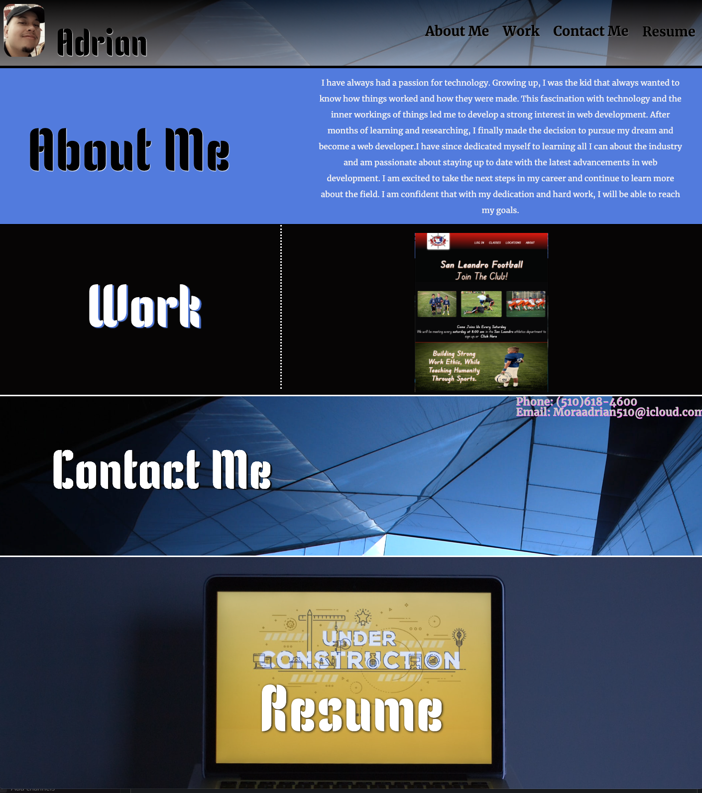

# Professional Portfolio

## Table of Contents

- [Overview](#overview)
- [Built With](#built-with)
- [Features](#features)
- [Contact](#contact)
- [Acknowledgements](#acknowledgements)

## Overview
<<<<<<< HEAD
    
=======
   
>>>>>>> 2cb00a1 (read me update2)
   
   
   [portfolio live web page](https://moraadrian510.github.io/pro-portfolio/)
   
    I definiteley had fun creating this project,
    In this project i learned from mistakes using flexbox and my positioning. Due to time connstraints i 
    was not able to change as much as i would have liked to ,but it will carry on to future projects.
<<<<<<< HEAD
    /lph7.∆hytv 
.=;p8J?imijnuum/l['m,l… 'live demo.'
    2. Describe your overall experience in a couple of sentences.
    3. List a few specific technical things that you learned or improved on.
    4. Share any other tips or guidance for others attempting this or something similar.

=======
    
>>>>>>> 2cb00a1 (read me update2)
### Built With

     1. HTML
     2. CSS
     
## Features

     This project showcases and represents me to future employers . It shows who i am, my past work and how to contact me if they are 
     interested in knowing more about me.

## Contact
     
     Adrian Mora: moraadrian510@icloud.com
     
## Acknowledgements

  1. stackoverflow
  2. Askbcs Learning Assistance.
  3. My Classmates 
